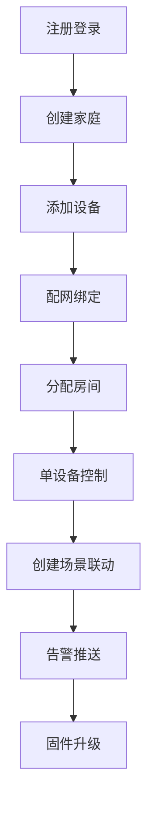
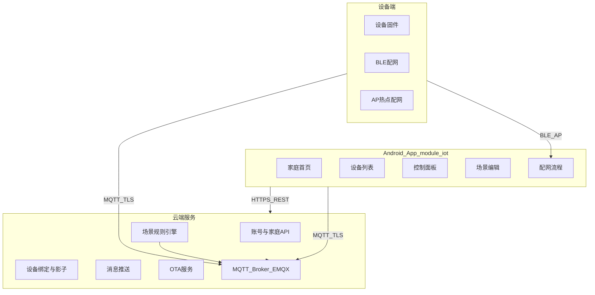
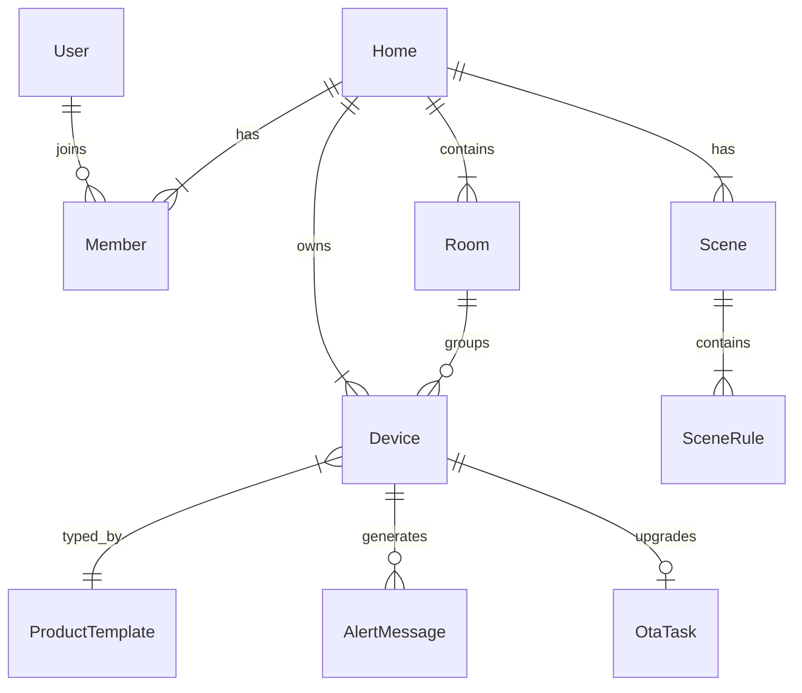

# module_iot 多设备智能家居产品需求文档（PRD）

| 项目 | 说明 |
|------|------|
| 文档版本 | v1.0 |
| 更新日期 | 2026-06-09 |
| 所属模块 | `module_iot`（`com.yung.iot`） |
| 对标产品 | 米家、涂鸦智能、华为智慧生活 |
| 范围 | Android App + 云端服务 + 设备端固件/配网协议 |
| 技术基线 | Eclipse Paho MQTT + EMQX TLS（见 [README.md](../README.md)） |

---

## 目录

1. [产品概述](#1-产品概述)
2. [用户角色与核心场景](#2-用户角色与核心场景)
3. [系统架构](#3-系统架构)
4. [Android App 功能需求](#4-android-app-功能需求)
5. [云端功能需求](#5-云端功能需求)
6. [设备端与配网协议](#6-设备端与配网协议)
7. [数据模型](#7-数据模型)
8. [非功能需求](#8-非功能需求)
9. [分阶段实施路线图](#9-分阶段实施路线图)
10. [附录](#10-附录)

---

## 1. 产品概述

### 1.1 产品定位

将 `module_iot` 从 **单连接 MQTT 调试页** 演进为面向 C 端用户的 **家庭多设备统一管理 App**，覆盖智能灯、插座、温湿度传感器、门磁、烟雾报警器、摄像头等主流智能家居品类。

用户可在单一 App 内完成：设备配网绑定、房间分组、实时控制、场景自动化、远程告警接收与固件升级。

### 1.2 目标用户

| 用户类型 | 描述 |
|----------|------|
| 家庭管理员 | 创建家庭、邀请成员、添加/删除设备、分配房间、配置场景 |
| 家庭成员 | 查看与控制已授权设备、接收告警通知 |
| 访客（P2） | 临时授权部分设备，限时失效 |
| 设备厂商/运维 | 维护产品型号模板、发布 OTA 包、监控设备在线率 |

### 1.3 核心价值

- **一键配网**：BLE / AP 热点 / 扫码，降低添加设备门槛
- **房间分组**：按空间组织设备，首页一目了然
- **实时控制**：MQTT 长连接，控制指令端到端 < 2s
- **场景自动化**：多设备联动，对标米家「自动化」
- **远程告警**：烟雾、门磁、低电量、离线等推送至手机
- **固件 OTA**：App 内一键升级，进度可视

### 1.4 与现状关系

当前 [`IotMainActivity`](../src/main/java/com/yung/iot/IotMainActivity.kt) 提供：

- 硬编码 Broker 连接（`ssl://host:8883`）
- 单 Topic 订阅与发布
- 内联 Compose 调试 UI

**演进策略**：

| 现状能力 | 演进方向 |
|----------|----------|
| MQTT 连接/订阅/发布 | 抽取为 `MqttConnectionManager`，支持多 Topic、用户级 ACL |
| 调试 UI | Phase 3 迁移至 `/iot/debug/mqtt`，不对 C 端用户暴露 |
| 路由 `/iot/main` | 重构为家庭设备总览首页 |
| README 运维说明 | 保留，PRD 不重复 Broker 配置细节 |

---

## 2. 用户角色与核心场景

### 2.1 角色权限矩阵

| 能力 | 管理员 | 成员 | 访客（P2） |
|------|:------:|:----:|:----------:|
| 查看设备列表 | ✓ | ✓ | 部分 |
| 控制设备 | ✓ | ✓ | 部分 |
| 添加/删除设备 | ✓ | ✗ | ✗ |
| 管理房间 | ✓ | ✗ | ✗ |
| 创建/编辑场景 | ✓ | ✓（可配置） | ✗ |
| 邀请成员 | ✓ | ✗ | ✗ |
| 设备分享（跨家庭） | ✓ | ✗ | ✗ |
| 触发 OTA | ✓ | ✗ | ✗ |

### 2.2 核心用户旅程



### 2.3 用户故事与验收标准

#### US-001 注册与登录

> **作为** 新用户，**我希望** 使用手机号验证码快速注册，**以便** 开始使用智能家居功能。

**验收标准（Given/When/Then）**：

- Given 用户未登录，When 输入合法手机号并收到验证码，Then 60s 内完成注册并进入「创建家庭」引导页
- Given 用户已注册，When 验证码登录成功，Then 恢复上次选中的家庭上下文
- Given 验证码错误，When 连续失败 5 次，Then 锁定 15 分钟并提示

#### US-002 创建家庭

> **作为** 家庭管理员，**我希望** 创建家庭并命名，**以便** 管理名下所有设备。

**验收标准**：

- Given 用户无家庭，When 输入家庭名称（1–20 字）并确认，Then 创建成功且用户自动成为管理员
- Given 用户已有家庭，When 创建第二个家庭，Then 支持最多 5 个家庭（可配置）

#### US-003 添加设备（BLE 配网）

> **作为** 管理员，**我希望** 通过蓝牙发现并配置 Wi-Fi，**以便** 将新灯/插座接入家庭。

**验收标准**：

- Given 设备处于配网模式（指示灯闪烁），When App 扫描到 BLE 广播，Then 30s 内展示设备型号与信号强度
- Given 用户选择家庭 Wi-Fi 并输入密码，When 下发配网信息，Then 120s 内设备连网并成功绑定至当前家庭
- Given 配网超时，When 用户点击重试，Then 回到「发现设备」步骤并保留已选 Wi-Fi

#### US-004 设备控制

> **作为** 家庭成员，**我希望** 在控制面板开关设备，**以便** 远程管理家中电器。

**验收标准**：

- Given 设备在线，When 用户拨动开关，Then UI 乐观更新，2s 内收到 MQTT 属性确认或回滚
- Given 设备离线，When 用户尝试控制，Then 禁用操作并提示「设备已离线」
- Given 控制失败，When 云端返回错误，Then Toast 展示可读错误信息

#### US-005 房间分组

> **作为** 管理员，**我希望** 将设备分配到客厅/卧室等房间，**以便** 按空间浏览。

**验收标准**：

- Given 家庭有未分配设备，When 拖拽至目标房间，Then 设备 `roomId` 更新且首页 Tab 同步
- Given 房间无设备，When 查看房间 Tab，Then 展示空态引导「添加设备」

#### US-006 场景自动化

> **作为** 用户，**我希望** 设置「开门即开灯」自动化，**以便** 无需手动操作。

**验收标准**：

- Given 创建场景「门磁打开 → 客厅灯开启」，When 门磁上报 `open`，Then 3s 内客厅灯收到开启指令
- Given 场景含多条件，When 选择「满足任一」，Then 任一触发器满足即执行动作

#### US-007 告警通知

> **作为** 用户，**我希望** 收到烟雾报警推送，**以便** 及时处理险情。

**验收标准**：

- Given 烟雾传感器上报 `alarm` 事件，When App 在后台，Then FCM 推送到达且点击跳转设备详情
- Given 用户在消息中心，When 查看告警列表，Then 按时间倒序展示，未读角标正确

#### US-008 固件升级

> **作为** 管理员，**我希望** 在 App 内升级设备固件，**以便** 修复漏洞或获得新功能。

**验收标准**：

- Given 云端有新版本，When 进入设备设置，Then 展示「可升级至 vX.X.X」
- Given 用户确认升级，When OTA 进行中，Then 展示进度条；失败可重试，成功自动刷新 `fwVersion`

---

## 3. 系统架构

### 3.1 全栈架构图



### 3.2 通信通道职责

| 通道 | 用途 | 协议 |
|------|------|------|
| REST/HTTPS | 账号、家庭、设备绑定、场景 CRUD、OTA 元数据 | TLS 1.2+ |
| MQTT | 实时属性上报/下发、事件、在线状态、OTA 数据传输 | TLS（`ssl://`） |
| FCM | 告警与系统通知（App 后台/进程被杀） | Google Push |
| BLE | 配网阶段下发 Wi-Fi 凭据 | GATT |
| AP 热点 | 摄像头/网关类配网 | HTTP（设备局域网） |

### 3.3 Android 端技术选型

与仓库现有模块对齐：

| 层级 | 技术 | 参考模块 |
|------|------|----------|
| UI | Jetpack Compose + Material3 | `module_iot` / `module_home` |
| 状态管理 | Orbit MVI（`ContainerHost`） | `module_home` CategoryListViewModel |
| 路由 | ARouter + `RoutePath` | `module_route` |
| HTTP | Ktor Client + kotlinx.serialization | `module_home` SleepHttpClient |
| 本地存储 | Room | `module_pdf` RecentFileDb |
| MQTT | Paho + hannesa2 Android Service | `module_iot` 现有实现 |
| 推送 | FCM | 宿主 App 集成 |

### 3.4 建议代码包结构

```
com.yung.iot/
├── api/
│   ├── IotSdk.kt              # 模块初始化（Broker 地址、用户 Token）
│   └── IotLauncher.kt         # 对外跳转门面
├── data/
│   ├── api/                   # REST 接口定义
│   ├── model/                 # DTO / 领域模型
│   ├── repository/            # DeviceRepository, HomeRepository, SceneRepository
│   └── db/                    # Room Entity / DAO
├── mqtt/
│   ├── MqttConnectionManager.kt   # 单例长连接，多 Topic 订阅
│   ├── MqttTopicResolver.kt       # deviceId → topic 映射
│   └── MqttMessageParser.kt       # JSON Payload 解析
├── provision/
│   ├── ble/                   # BLE 扫描与 GATT 写
│   ├── ap/                    # AP 热点配网
│   └── qr/                    # 扫码解析 bindToken
└── ui/
    ├── home/                  # 家庭首页 Activity + Screen + ViewModel
    ├── device/                # 列表、详情、设置
    ├── provision/             # 配网向导
    ├── room/                  # 房间管理
    ├── scene/                 # 场景列表与编辑
    ├── message/               # 消息中心
    └── debug/                 # MQTT 调试（自 IotMainActivity 迁移）
```

---

## 4. Android App 功能需求

### 4.1 信息架构与路由表

路由常量扩展至 [`RoutePath.kt`](../../module_route/src/main/java/com/yung/route/RoutePath.kt) 的 `Iot` 对象：

| 模块 | 页面 | 路由 | 优先级 | Activity 类名建议 |
|------|------|------|:------:|-------------------|
| 家庭 | 家庭列表 / 切换 | `/iot/home/list` | P0 | `HomeListActivity` |
| 首页 | 设备总览（房间 Tab） | `/iot/main` | P0 | `IotMainActivity`（重构） |
| 设备 | 设备列表 | `/iot/device/list` | P0 | `DeviceListActivity` |
| 设备 | 控制面板 | `/iot/device/detail` | P0 | `DeviceDetailActivity` |
| 配网 | 添加设备向导 | `/iot/provision/start` | P0 | `ProvisionActivity` |
| 房间 | 房间管理 | `/iot/room/manage` | P1 | `RoomManageActivity` |
| 场景 | 场景列表 | `/iot/scene/list` | P1 | `SceneListActivity` |
| 场景 | 场景编辑 | `/iot/scene/edit` | P1 | `SceneEditActivity` |
| 消息 | 通知中心 | `/iot/message/list` | P1 | `MessageListActivity` |
| 设置 | 设备设置 | `/iot/device/settings` | P0 | `DeviceSettingsActivity` |
| 设置 | OTA 升级 | `/iot/device/ota` | P1 | `DeviceOtaActivity` |
| 诊断 | MQTT 调试 | `/iot/debug/mqtt` | P2 | `MqttDebugActivity` |

**路由参数约定**：

| 路由 | Extra 参数 | 类型 | 说明 |
|------|-------------|------|------|
| `/iot/main` | `homeId` | String | 可选，默认上次选中家庭 |
| `/iot/device/detail` | `deviceId` | String | 必填 |
| `/iot/device/settings` | `deviceId` | String | 必填 |
| `/iot/provision/start` | `productId` | String | 可选，扫码/手动选品类 |
| `/iot/scene/edit` | `sceneId` | String | 可选，新建时不传 |

**宿主集成**：在 [`HostNavigator.kt`](../../module_host/src/main/java/com/yung/host/HostNavigator.kt) 扩展：

```kotlin
fun toIotHome(context: Context, homeId: String? = null)
fun toIotProvision(context: Context, productId: String? = null)
fun toIotDeviceDetail(context: Context, deviceId: String)
```

### 4.2 页面功能详述

#### 4.2.1 家庭首页（`/iot/main`）

**布局**：

- 顶栏：家庭名称（点击展开切换抽屉）、添加设备「+」、消息铃铛（未读角标）
- 房间 Tab：横向滑动（全部 / 客厅 / 卧室 / …）
- 设备卡片网格：2 列，展示图标、名称、状态摘要、在线点

**设备卡片状态摘要规则**：

| 品类 | 摘要文案示例 |
|------|-------------|
| 灯/插座 | `开启` / `关闭` |
| 温湿度传感器 | `26°C · 65%` |
| 门磁 | `关闭` / `打开` |
| 烟雾报警器 | `正常` / `报警` |

**交互**：

- 下拉刷新：拉取云端设备列表 + 影子快照
- 点击卡片：跳转控制面板
- 长按卡片：快捷开关（灯/插座类）
- 离线设备：卡片置灰 + 右上角「离线」角标

**验收标准**：

- Given 本地有缓存，When 打开首页，Then 1s 内展示缓存数据，后台静默刷新
- Given 切换房间 Tab，When 选择「卧室」，Then 仅展示 `roomId` 匹配设备

#### 4.2.2 设备列表（`/iot/device/list`）

- 支持按在线状态筛选（全部 / 在线 / 离线）
- 支持按品类筛选
- 列表项：图标、名称、房间、在线状态、最近更新时间

#### 4.2.3 控制面板（`/iot/device/detail`）

按 `ProductTemplate` 动态渲染控件：

| 控件类型 | 适用属性 | 交互 |
|----------|----------|------|
| `switch` | `power` | Toggle 开关 |
| `slider` | `brightness`, `colorTemp` | 0–100 滑动条 |
| `enum` | `mode` | 底部选择器（制冷/制热/自动） |
| `readonly` | `temperature`, `humidity` | 只读数值 + 更新时间 |
| `chart` | 历史数据（P2） | 24h 折线图占位 |

顶部：设备名称、在线状态、设置入口（齿轮）

**验收标准**：

- Given 设备模板含 `brightness` slider，When 拖动至 80%，Then 下发 MQTT `property/set` 且 UI 显示 80%
- Given 收到 `property/post` 与本地不一致，When 设备主动变化，Then UI 自动同步

#### 4.2.4 添加设备向导（`/iot/provision/start`）

**步骤条**（4 步）：

1. **选择方式**：BLE 配网 / AP 配网 / 扫码绑定
2. **发现设备**：BLE 扫描列表 / 扫码解析 / 连接设备热点
3. **配置网络**：选择 Wi-Fi（需定位权限）、输入密码
4. **绑定完成**：设备命名、选择房间、完成

**失败处理**：

| 错误码 | 用户提示 | 建议操作 |
|--------|----------|----------|
| `PROV_BLE_NOT_FOUND` | 未发现设备，请确认指示灯闪烁 | 重试扫描 |
| `PROV_WIFI_WRONG` | Wi-Fi 密码错误或信号弱 | 重新输入 |
| `PROV_BIND_TIMEOUT` | 绑定超时，请重试 | 从头开始 |
| `PROV_TOKEN_EXPIRED` | 二维码已过期 | 重新扫码 |

#### 4.2.5 房间管理（`/iot/room/manage`）

- 房间 CRUD（预设：客厅、卧室、厨房、卫生间、阳台）
- 拖拽排序
- 设备拖拽至房间（管理模式下）

#### 4.2.6 场景列表与编辑（`/iot/scene/list`, `/iot/scene/edit`）

**场景结构**：

```
Scene
├── name: String
├── enabled: Boolean
├── conditionLogic: ALL | ANY
├── triggers: [Trigger]
└── actions: [Action]
```

**Trigger 类型**：设备属性变化、定时（cron）、手动执行（P1）

**Action 类型**：设备控制、推送通知、延迟 N 秒执行

**编辑页交互**：

- IF 区：添加条件 → 选择设备 → 选择属性 → 选择运算符（=、>、<）→ 输入值
- THEN 区：添加动作 → 选择设备 → 选择属性 → 输入目标值
- 支持「满足以下全部条件」/「满足任一条件」切换

#### 4.2.7 消息中心（`/iot/message/list`）

**消息分类 Tab**：全部 / 告警 / 系统

| 类型 | 示例 |
|------|------|
| 告警 | 客厅烟雾报警器触发报警 |
| 系统 | 成员「张三」加入了家庭 |
| 设备 | 卧室灯已离线超过 30 分钟 |

点击跳转关联设备详情或场景。

#### 4.2.8 设备设置（`/iot/device/settings`）

- 修改名称
- 更换房间
- 查看设备信息（型号、MAC、固件版本、IP）
- 分享设备（P2）
- 解绑设备（二次确认）
- 检查更新 → 跳转 OTA 页

#### 4.2.9 MQTT 调试页（`/iot/debug/mqtt`，P2）

迁移现有 `IotMainActivity` 调试能力：

- 手动连接 Broker、订阅 Topic、发布消息
- 展示原始 MQTT 日志
- 仅 Debug 构建或隐藏入口（连续点击版本号 7 次）

---

## 5. 云端功能需求

### 5.1 服务模块划分

| 服务 | 职责 |
|------|------|
| Auth Service | 注册、登录、Token 刷新、第三方 OAuth |
| Home Service | 家庭 CRUD、成员管理、邀请 |
| Device Service | 设备绑定/解绑、影子同步、在线状态 |
| Scene Service | 场景 CRUD、规则引擎调度 |
| OTA Service | 版本检查、固件分发、升级状态 |
| Push Service | FCM 推送、消息持久化 |
| MQTT Broker | EMQX，ACL 鉴权，Webhook 转设备事件 |

### 5.2 REST API 接口草案

**通用约定**：

- Base URL：`https://api.example.com`
- 认证：`Authorization: Bearer <accessToken>`
- 响应格式：`{ "code": 0, "message": "ok", "data": { ... } }`
- 分页：`?page=1&pageSize=20`，响应含 `total`

#### 5.2.1 账号与认证

| 接口 | 方法 | 说明 |
|------|------|------|
| `/v1/auth/sms/send` | POST | 发送验证码 `{ "phone": "13800138000" }` |
| `/v1/auth/sms/login` | POST | 验证码登录，返回 `accessToken` + `refreshToken` |
| `/v1/auth/refresh` | POST | 刷新 Token |
| `/v1/auth/logout` | POST | 登出，失效 Token |

#### 5.2.2 家庭与成员

| 接口 | 方法 | 说明 |
|------|------|------|
| `/v1/homes` | GET | 当前用户家庭列表 |
| `/v1/homes` | POST | 创建家庭 `{ "name": "我的家" }` |
| `/v1/homes/{homeId}` | GET/PATCH/DELETE | 家庭详情 / 改名 / 解散 |
| `/v1/homes/{homeId}/rooms` | GET/POST | 房间列表 / 创建房间 |
| `/v1/homes/{homeId}/rooms/{roomId}` | PATCH/DELETE | 房间改名 / 删除 |
| `/v1/homes/{homeId}/members` | GET | 成员列表 |
| `/v1/homes/{homeId}/members/invite` | POST | 生成邀请链接/二维码 |
| `/v1/homes/{homeId}/members/{userId}` | DELETE | 移除成员 |
| `/v1/homes/{homeId}/members/{userId}/role` | PATCH | 修改角色 `{ "role": "admin" \| "member" }` |

#### 5.2.3 设备管理

| 接口 | 方法 | 说明 |
|------|------|------|
| `/v1/devices/bind` | POST | 配网后绑定（见请求体） |
| `/v1/devices` | GET | 设备列表 `?homeId=&roomId=&online=` |
| `/v1/devices/{deviceId}` | GET | 设备详情 |
| `/v1/devices/{deviceId}` | PATCH | 更新名称/房间 `{ "name", "roomId" }` |
| `/v1/devices/{deviceId}` | DELETE | 解绑设备 |
| `/v1/devices/{deviceId}/shadow` | GET | 设备影子（reported + desired） |
| `/v1/devices/{deviceId}/command` | POST | 下发控制指令 |
| `/v1/products` | GET | 产品型号列表（品类模板） |
| `/v1/products/{productId}` | GET | 产品详情（属性定义、UI 模板） |

**`POST /v1/devices/bind` 请求体**：

```json
{
  "homeId": "home_abc123",
  "roomId": "room_living",
  "productId": "light_rgb_v1",
  "deviceId": "dev_9f3a2b1c",
  "bindToken": "bt_xyz789",
  "name": "客厅吸顶灯"
}
```

**`POST /v1/devices/{deviceId}/command` 请求体**：

```json
{
  "params": {
    "power": true,
    "brightness": 80
  }
}
```

响应：`{ "commandId": "cmd_001", "status": "sent" }`

#### 5.2.4 场景

| 接口 | 方法 | 说明 |
|------|------|------|
| `/v1/scenes` | GET | 场景列表 `?homeId=` |
| `/v1/scenes` | POST | 创建场景 |
| `/v1/scenes/{sceneId}` | GET/PATCH/DELETE | 详情 / 更新 / 删除 |
| `/v1/scenes/{sceneId}/execute` | POST | 手动执行场景 |
| `/v1/scenes/{sceneId}/enable` | PATCH | 启用/禁用 `{ "enabled": true }` |

**`POST /v1/scenes` 请求体示例**：

```json
{
  "homeId": "home_abc123",
  "name": "回家开灯",
  "enabled": true,
  "conditionLogic": "ALL",
  "triggers": [
    {
      "type": "device_property",
      "deviceId": "dev_door01",
      "property": "contact",
      "operator": "eq",
      "value": "open"
    }
  ],
  "actions": [
    {
      "type": "device_control",
      "deviceId": "dev_light01",
      "params": { "power": true }
    }
  ]
}
```

#### 5.2.5 消息

| 接口 | 方法 | 说明 |
|------|------|------|
| `/v1/messages` | GET | 消息列表 `?homeId=&type=&page=` |
| `/v1/messages/{messageId}/read` | PATCH | 标记已读 |
| `/v1/messages/read-all` | POST | 全部已读 `{ "homeId" }` |
| `/v1/messages/unread-count` | GET | 未读数 `?homeId=` |

#### 5.2.6 OTA

| 接口 | 方法 | 说明 |
|------|------|------|
| `/v1/ota/check` | GET | 检查更新 `?deviceId=` |
| `/v1/ota/upgrade` | POST | 触发升级 `{ "deviceId" }` |
| `/v1/ota/tasks/{taskId}` | GET | 查询升级任务状态 |

**`GET /v1/ota/check` 响应示例**：

```json
{
  "currentVersion": "1.0.0",
  "latestVersion": "1.1.0",
  "changelog": "修复连接稳定性",
  "fileSize": 524288,
  "needUpgrade": true
}
```

#### 5.2.7 MQTT 连接凭证

| 接口 | 方法 | 说明 |
|------|------|------|
| `/v1/mqtt/credentials` | GET | 获取用户级 MQTT 连接参数 |

**响应示例**：

```json
{
  "broker": "ssl://mqtt.example.com:8883",
  "clientId": "app_user_12345",
  "username": "user_12345",
  "password": "<temporary_token>",
  "expireAt": 1749456000000,
  "subscribeTopics": [
    "iot/+/+/property/post",
    "iot/+/+/event/post",
    "iot/+/+/state"
  ]
}
```

### 5.3 设备影子模型

云端为每个 `deviceId` 维护影子文档：

```json
{
  "deviceId": "dev_9f3a2b1c",
  "productId": "light_rgb_v1",
  "reported": {
    "power": true,
    "brightness": 80,
    "colorTemp": 4000
  },
  "desired": {
    "power": true,
    "brightness": 80
  },
  "metadata": {
    "reported": {
      "power": { "timestamp": 1749455900000 },
      "brightness": { "timestamp": 1749455900000 }
    }
  },
  "online": true,
  "lastSeen": 1749455900000
}
```

**同步规则**：

1. 设备上报 `property/post` → 更新 `reported` + `lastSeen` + `online=true`
2. App/云端下发 `property/set` → 更新 `desired`，转发 MQTT 至设备
3. 设备执行后上报 → `reported` 与 `desired` 对齐
4. 超过 90s 无上报且 MQTT 断开 → `online=false`，触发离线消息

### 5.4 在线状态判定

| 信号源 | 权重 | 说明 |
|--------|------|------|
| EMQX 连接事件 | 高 | `$events/client_connected` / `disconnected` Webhook |
| 属性上报心跳 | 中 | 定期 `property/post`（设备每 60s 上报） |
| 主动探测 | 低 | 云端下发 `ping`（P2） |

### 5.5 场景规则引擎

- 部署于云端，订阅 MQTT `property/post` 与 `event/post`
- 条件匹配后向目标设备 Topic 发布 `property/set`
- 支持防抖：同一触发器 5s 内不重复执行
- 定时触发：基于 cron 表达式，云端调度器触发

### 5.6 消息推送

| 事件 | 推送渠道 | 消息中心 |
|------|----------|----------|
| 烟雾报警 | FCM 高优先级 | 写入 |
| 门磁触发 | FCM 普通 | 写入 |
| 设备离线 > 30min | FCM 普通 | 写入 |
| 成员加入 | FCM 普通 | 写入 |
| OTA 完成/失败 | FCM 普通 | 写入 |

---

## 6. 设备端与配网协议

### 6.1 设备标识

| 字段 | 说明 | 示例 |
|------|------|------|
| `productId` | 产品型号，关联品类模板 | `light_rgb_v1` |
| `deviceId` | 全局唯一，出厂烧录或首次配网生成 | `dev_9f3a2b1c` |
| `mac` | Wi-Fi MAC 地址 | `AA:BB:CC:DD:EE:FF` |
| `fwVersion` | 当前固件版本 | `1.0.0` |
| `hwVersion` | 硬件版本 | `1.0` |

### 6.2 配网方式

#### 6.2.1 BLE + Wi-Fi 配网（P0）

**适用品类**：智能灯、插座、传感器

**BLE 广播数据**（Manufacturer Data）：

```
[0xFF, 0xFF]  // 厂商 ID
[0x01]        // 协议版本
[productId 变长 UTF-8]
[deviceId 16 字节]
[bindToken 32 字节]
```

**GATT 服务 UUID**：`0000FFF0-0000-1000-8000-00805F9B34FB`

**配网 Write 特征值**（`FFF1`）Payload（JSON）：

```json
{
  "ssid": "Home_WiFi",
  "password": "wifipassword",
  "bindToken": "bt_xyz789",
  "server": "mqtt.example.com",
  "port": 8883
}
```

**设备配网后行为**：

1. 连接 Wi-Fi
2. MQTT 连接 Broker（一机一密）
3. 发布 `bind/request` 消息（含 `bindToken`）
4. 云端验证 Token 完成绑定

#### 6.2.2 AP 热点配网（P1）

**适用品类**：摄像头、网关

**流程**：

1. 设备开启热点 `SmartDevice_XXXX`
2. App 连接热点，访问 `http://192.168.4.1/provision`
3. POST Wi-Fi 凭据与 `bindToken`
4. 设备切换至家庭 Wi-Fi 并完成 MQTT 绑定

#### 6.2.3 扫码绑定（P0）

**二维码内容**（URL 或 JSON）：

```json
{
  "productId": "socket_v1",
  "deviceId": "dev_abc123",
  "bindToken": "bt_xyz789"
}
```

`bindToken` 一次性有效，5 分钟过期。

### 6.3 MQTT Topic 规范

**Topic 命名空间**：`iot/{productId}/{deviceId}/...`

| Topic | 方向 | QoS | Retain | 说明 |
|-------|------|:---:|--------|------|
| `iot/{productId}/{deviceId}/property/post` | 设备 → 云/App | 1 | 否 | 属性上报 |
| `iot/{productId}/{deviceId}/property/set` | 云/App → 设备 | 1 | 否 | 属性下发 |
| `iot/{productId}/{deviceId}/event/post` | 设备 → 云/App | 1 | 否 | 事件上报（告警） |
| `iot/{productId}/{deviceId}/state` | 设备 → 云/App | 1 | 是 | 在线状态 `online`/`offline` |
| `iot/{productId}/{deviceId}/ota/inform` | 设备 → 云 | 1 | 否 | 上报当前版本 |
| `iot/{productId}/{deviceId}/ota/firmware/get` | 设备 → 云 | 1 | 否 | 请求固件包 |
| `iot/{productId}/{deviceId}/ota/progress` | 设备 → 云/App | 0 | 否 | 升级进度 |
| `iot/{productId}/{deviceId}/bind/request` | 设备 → 云 | 1 | 否 | 配网后绑定请求 |

**App 订阅通配**（受 ACL 约束）：

```
iot/+/+/property/post
iot/+/+/event/post
iot/+/+/state
iot/+/+/ota/progress
```

### 6.4 MQTT Payload JSON 规范

**通用信封结构**：

```json
{
  "id": "msg_unique_id",
  "version": "1.0",
  "method": "property.post",
  "params": { },
  "timestamp": 1749455900000
}
```

| `method` 值 | 方向 | 说明 |
|-------------|------|------|
| `property.post` | 设备 → 上 | 属性上报 |
| `property.set` | 上 → 设备 | 属性下发 |
| `event.post` | 设备 → 上 | 事件上报 |
| `state.update` | 设备 → 上 | 在线状态 |
| `ota.inform` | 设备 → 上 | OTA 版本上报 |
| `ota.progress` | 设备 → 上 | OTA 进度 |

#### 6.4.1 属性上报示例（智能灯）

```json
{
  "id": "post_001",
  "version": "1.0",
  "method": "property.post",
  "params": {
    "power": true,
    "brightness": 80,
    "colorTemp": 4000
  },
  "timestamp": 1749455900000
}
```

#### 6.4.2 属性下发示例

```json
{
  "id": "set_001",
  "version": "1.0",
  "method": "property.set",
  "params": {
    "power": false
  },
  "timestamp": 1749455901000
}
```

#### 6.4.3 事件上报示例（烟雾报警）

```json
{
  "id": "evt_001",
  "version": "1.0",
  "method": "event.post",
  "params": {
    "eventType": "alarm",
    "alarmType": "smoke",
    "level": "critical"
  },
  "timestamp": 1749455902000
}
```

#### 6.4.4 在线状态（Retained）

```json
{
  "id": "state_001",
  "version": "1.0",
  "method": "state.update",
  "params": {
    "status": "online"
  },
  "timestamp": 1749455903000
}
```

### 6.5 品类属性定义示例

#### 智能灯（`light_rgb_v1`）

| 属性 | 类型 | 读写 | 范围 | UI 控件 |
|------|------|:----:|------|---------|
| `power` | bool | RW | — | switch |
| `brightness` | int | RW | 0–100 | slider |
| `colorTemp` | int | RW | 2700–6500 | slider |

#### 智能插座（`socket_v1`）

| 属性 | 类型 | 读写 | UI 控件 |
|------|------|:----:|---------|
| `power` | bool | RW | switch |
| `energy` | float | R | readonly（累计用电量 kWh） |

#### 温湿度传感器（`sensor_temp_humi_v1`）

| 属性 | 类型 | 读写 | UI 控件 |
|------|------|:----:|---------|
| `temperature` | float | R | readonly |
| `humidity` | float | R | readonly |
| `battery` | int | R | readonly（电量 %） |

### 6.6 安全要求

| 项 | 要求 | 阶段 |
|----|------|------|
| 传输加密 | MQTT TLS（8883）、HTTPS | P0 |
| 设备认证 | 一机一密（`deviceId` + `deviceSecret`） | P0 |
| 绑定安全 | `bindToken` 一次性、5 分钟过期 | P0 |
| App MQTT ACL | 按 `homeId` 过滤，仅可订阅/发布已绑定设备 Topic | P0 |
| 双向 TLS | 设备证书认证 | P2 |
| 固件签名校验 | OTA 包 RSA 签名 | P1 |

---

## 7. 数据模型

### 7.1 实体关系



### 7.2 核心实体字段

#### User

| 字段 | 类型 | 说明 |
|------|------|------|
| `userId` | String | 主键 |
| `phone` | String | 手机号 |
| `nickname` | String | 昵称 |
| `avatar` | String? | 头像 URL |
| `createdAt` | Long | 注册时间 |

#### Home

| 字段 | 类型 | 说明 |
|------|------|------|
| `homeId` | String | 主键 |
| `name` | String | 家庭名称 |
| `ownerId` | String | 管理员 userId |
| `createdAt` | Long | 创建时间 |

#### Room

| 字段 | 类型 | 说明 |
|------|------|------|
| `roomId` | String | 主键 |
| `homeId` | String | 外键 |
| `name` | String | 房间名 |
| `sortOrder` | Int | 排序权重 |

#### Member

| 字段 | 类型 | 说明 |
|------|------|------|
| `homeId` | String | 外键 |
| `userId` | String | 外键 |
| `role` | Enum | `admin` / `member` / `guest` |
| `joinedAt` | Long | 加入时间 |

#### Device

| 字段 | 类型 | 说明 |
|------|------|------|
| `deviceId` | String | 主键 |
| `homeId` | String | 外键 |
| `roomId` | String? | 外键，可空 |
| `productId` | String | 产品型号 |
| `name` | String | 用户自定义名称 |
| `mac` | String | MAC 地址 |
| `fwVersion` | String | 固件版本 |
| `online` | Boolean | 在线状态 |
| `lastSeen` | Long | 最后上报时间 |

#### DeviceProperty（影子快照，App 本地缓存）

| 字段 | 类型 | 说明 |
|------|------|------|
| `deviceId` | String | 外键 |
| `key` | String | 属性名 |
| `value` | String | JSON 序列化值 |
| `timestamp` | Long | 更新时间 |

#### Scene

| 字段 | 类型 | 说明 |
|------|------|------|
| `sceneId` | String | 主键 |
| `homeId` | String | 外键 |
| `name` | String | 场景名称 |
| `enabled` | Boolean | 是否启用 |
| `conditionLogic` | Enum | `ALL` / `ANY` |
| `triggers` | JSON | 触发器数组 |
| `actions` | JSON | 动作数组 |

#### AlertMessage

| 字段 | 类型 | 说明 |
|------|------|------|
| `messageId` | String | 主键 |
| `homeId` | String | 外键 |
| `deviceId` | String? | 关联设备 |
| `type` | Enum | `alarm` / `system` / `device` |
| `title` | String | 标题 |
| `content` | String | 正文 |
| `read` | Boolean | 是否已读 |
| `createdAt` | Long | 创建时间 |

#### OtaTask

| 字段 | 类型 | 说明 |
|------|------|------|
| `taskId` | String | 主键 |
| `deviceId` | String | 外键 |
| `fromVersion` | String | 源版本 |
| `toVersion` | String | 目标版本 |
| `status` | Enum | `pending` / `downloading` / `installing` / `success` / `failed` |
| `progress` | Int | 0–100 |
| `createdAt` | Long | 创建时间 |

#### ProductTemplate

| 字段 | 类型 | 说明 |
|------|------|------|
| `productId` | String | 主键 |
| `name` | String | 产品名称 |
| `category` | Enum | `light` / `socket` / `sensor` / `camera` / `gateway` |
| `icon` | String | 图标 URL |
| `properties` | JSON | 属性定义列表 |
| `provisionType` | Enum | `ble` / `ap` / `qr` |

---

## 8. 非功能需求

### 8.1 性能

| 指标 | 目标 |
|------|------|
| 首页首屏（有缓存） | < 1s |
| 首页首屏（无缓存） | < 3s |
| 控制指令端到端 | < 2s（P95） |
| 设备列表分页加载 | < 1s / 页 |
| MQTT 重连 | 断线后 30s 内恢复 |
| 配网全流程 | < 120s（P95） |

### 8.2 可靠性

- MQTT 断线指数退避重连：1s → 2s → 4s → … → 60s 上限
- App 控制指令乐观更新 + 超时回滚（5s）
- 离线操作队列（P2）：网络恢复后重发未确认指令
- 本地 Room 缓存设备列表与影子，无网可浏览（不可控制）

### 8.3 安全

- 全链路 TLS，禁止明文 MQTT
- `deviceSecret`、用户 Token 不进 Logcat
- ProGuard 混淆发布包
- 证书 Pinning（P2）

### 8.4 兼容性

- minSdk 26，targetSdk 跟随宿主 App
- Android 13+ 前台服务类型 `dataSync`（已有 Paho 适配，见 README）
- 支持竖屏为主；平板适配为 P2

### 8.5 隐私与权限

按需申请，首次使用时说明用途：

| 权限 | 用途 | 阶段 |
|------|------|------|
| `INTERNET` | 网络通信 | P0 |
| `ACCESS_NETWORK_STATE` | 网络状态检测 | P0 |
| `BLUETOOTH_SCAN` / `BLUETOOTH_CONNECT` | BLE 配网 | P0 |
| `ACCESS_FINE_LOCATION` | BLE 扫描 / Wi-Fi 列表（Android 要求） | P0 |
| `NEARBY_WIFI_DEVICES` | Wi-Fi 列表（Android 13+） | P0 |
| `CAMERA` | 扫码绑定 | P0 |
| `CHANGE_WIFI_STATE` | AP 配网切换网络 | P1 |
| `POST_NOTIFICATIONS` | 告警推送（Android 13+） | P1 |

### 8.6 可观测性

- 客户端埋点：配网成功率、控制延迟、MQTT 重连次数
- 云端监控：设备在线率、消息堆积、API P99 延迟
- 日志标签：`IotMqtt`, `IotProvision`, `IotDevice`

---

## 9. 分阶段实施路线图

### Phase 0 — 文档与协议（当前交付）

| 交付物 | 状态 |
|--------|------|
| 本 PRD 文档 | ✓ |
| MQTT Topic / Payload 规范 | ✓ 见第 6 章 |
| REST API 草案 | ✓ 见第 5 章 |
| 品类模板示例（灯/插座/传感器） | ✓ 见第 6.5 节 |
| 竞品对照表 | ✓ 见附录 A |

### Phase 1 — 多设备 MVP

**目标**：App + 云最小闭环，单家庭、单品类（智能灯）可配网、可控制。

| 端 | 任务 |
|----|------|
| 云端 | Auth、Home、Device bind/list/shadow/command API；EMQX ACL |
| App | 重构 `IotMainActivity` 为家庭首页；`DeviceDetailActivity` 灯控面板；BLE 配网流程 |
| MQTT | `MqttConnectionManager` 抽取；多 Topic 订阅；属性同步 |
| 设备 | 灯固件：BLE 配网 + property post/set |

**迁移策略（`IotMainActivity`）**：

```
Step 1: 抽取 mqtt/MqttConnectionManager.kt（从现有 connect/subscribe/publish 迁移）
Step 2: 新建 ui/home/IotMainScreen.kt + IotMainViewModel（Orbit MVI）
Step 3: IotMainActivity 瘦身为路由壳（setContent { IotMainScreen() }）
Step 4: 新建 ui/debug/MqttDebugActivity.kt，将原调试 UI 与硬编码 Broker 迁入
Step 5: RoutePath 扩展；HostNavigator 增加 toIotHome / toIotProvision
```

**Phase 1 验收**：

- 用户可注册登录、创建家庭
- 用户可通过 BLE 添加一盏灯
- 首页展示灯卡片，可开关控制
- 离线时卡片置灰

### Phase 2 — 体验完善

| 功能 | 说明 |
|------|------|
| 房间管理 | Tab 分组、拖拽分配 |
| 多品类 | 插座、温湿度传感器控制模板 |
| 场景自动化 | 创建/编辑/执行 |
| 消息中心 | 告警列表 + FCM 推送 |
| OTA | 版本检查 + 进度展示 |
| AP 配网 | 摄像头品类 |

### Phase 3 — 高级能力

| 功能 | 说明 |
|------|------|
| 多家庭切换 | 家庭列表抽屉 |
| 成员邀请 | 链接/二维码 |
| 访客权限 | 限时授权 |
| 摄像头 | 直播预览（RTSP/WebRTC） |
| MQTT 调试页 | `/iot/debug/mqtt` |
| 数据分析 | 用电统计、温湿度历史曲线 |
| 双向 TLS | 设备证书认证 |

---

## 10. 附录

### 附录 A：竞品功能对照表

| 功能 | 米家 | 涂鸦智能 | 华为智慧生活 | 本产品优先级 |
|------|:----:|:--------:|:------------:|:------------:|
| BLE 配网 | ✓ | ✓ | ✓ | P0 |
| AP 热点配网 | ✓ | ✓ | ✓ | P1 |
| 扫码添加 | ✓ | ✓ | ✓ | P0 |
| 房间分组 | ✓ | ✓ | ✓ | P1 |
| 设备卡片首页 | ✓ | ✓ | ✓ | P0 |
| 品类控制面板 | ✓ | ✓ | ✓ | P0 |
| 场景自动化 | ✓ | ✓ | ✓ | P1 |
| 手动场景 | ✓ | ✓ | ✓ | P1 |
| 告警推送 | ✓ | ✓ | ✓ | P1 |
| 固件 OTA | ✓ | ✓ | ✓ | P1 |
| 多家庭 | ✓ | ✓ | ✓ | P2 |
| 家庭成员共享 | ✓ | ✓ | ✓ | P2 |
| 设备共享（跨账号） | ✓ | ✓ | ✓ | P2 |
| 语音助手集成 | ✓ | ✓ | ✓ | 不做 |
| 商城/耗材 | ✓ | ✓ | — | 不做 |
| 社区/论坛 | ✓ | — | — | 不做 |
| 红外遥控 | ✓ | ✓ | — | P3 |
| 能耗统计 | ✓ | ✓ | ✓ | P2 |
| 摄像头直播 | ✓ | ✓ | ✓ | P3 |
| 蓝牙 Mesh | ✓ | — | ✓ | P3 |
| Zigbee 网关 | ✓ | ✓ | ✓ | P3 |

**差异化定位**：

- 聚焦 **MQTT 开放协议**，便于第三方设备接入
- 保留 **开发者 MQTT 调试页**，降低联调成本
- 模块化嵌入宿主 App（`module_iot`），非独立品牌 App

### 附录 B：错误码表

#### 配网错误（`PROV_`）

| 错误码 | HTTP/MQTT | 说明 | 用户提示 |
|--------|-----------|------|----------|
| `PROV_BLE_NOT_FOUND` | — | BLE 扫描超时 | 未发现设备，请确认指示灯闪烁 |
| `PROV_BLE_CONNECT_FAIL` | — | GATT 连接失败 | 蓝牙连接失败，请靠近设备 |
| `PROV_WIFI_WRONG` | — | Wi-Fi 密码错误 | Wi-Fi 密码错误或信号弱 |
| `PROV_WIFI_TIMEOUT` | — | 设备连网超时 | 设备连接 Wi-Fi 超时 |
| `PROV_BIND_TIMEOUT` | 408 | 绑定请求超时 | 绑定超时，请重试 |
| `PROV_TOKEN_EXPIRED` | 401 | bindToken 过期 | 二维码已过期，请重新扫码 |
| `PROV_TOKEN_INVALID` | 401 | bindToken 无效 | 绑定码无效 |
| `PROV_DEVICE_BOUND` | 409 | 设备已被其他家庭绑定 | 设备已被绑定 |

#### 设备控制错误（`DEV_`）

| 错误码 | 说明 | 用户提示 |
|--------|------|----------|
| `DEV_OFFLINE` | 设备离线 | 设备已离线 |
| `DEV_COMMAND_TIMEOUT` | 指令超时无响应 | 控制失败，请重试 |
| `DEV_NOT_FOUND` | 设备不存在 | 设备不存在 |
| `DEV_PERMISSION_DENIED` | 无权限 | 无权操作此设备 |

#### MQTT 错误（`MQTT_`）

| 错误码 | 说明 | 处理 |
|--------|------|------|
| `MQTT_CONNECT_FAIL` | Broker 连接失败 | 自动重连 |
| `MQTT_AUTH_FAIL` | 认证失败 | 刷新 MQTT 凭证 |
| `MQTT_SUBSCRIBE_FAIL` | 订阅失败 | 重试订阅 |
| `MQTT_DISCONNECTED` | 连接断开 | 指数退避重连 |

#### 账号错误（`AUTH_`）

| 错误码 | 说明 |
|--------|------|
| `AUTH_TOKEN_EXPIRED` | accessToken 过期，需刷新 |
| `AUTH_SMS_RATE_LIMIT` | 验证码发送频率限制 |
| `AUTH_SMS_INVALID` | 验证码错误 |

### 附录 C：宿主集成说明

#### 依赖配置

```kotlin
// module_host/build.gradle.kts
dependencies {
    api(project(":module_iot"))
}
```

#### Application 初始化

```kotlin
// MyApplication.onCreate()
IotSdk.init(
    context = this,
    apiBaseUrl = "https://api.example.com",
    // MQTT Broker 由 /v1/mqtt/credentials 动态获取
)
RouteInitializer.init(this)
```

#### 导航入口

```kotlin
// 跳转家庭首页
HostNavigator.toIotHome(context)

// 跳转添加设备
HostNavigator.toIotProvision(context)

// 跳转设备详情
HostNavigator.toIotDeviceDetail(context, deviceId = "dev_xxx")
```

#### Manifest 合并

模块 Manifest 在现有基础上扩展（见附录 D），合并到宿主 App 后生效。

### 附录 D：Android 权限清单

**现有权限**（`module_iot/AndroidManifest.xml`）：

- `INTERNET`
- `WAKE_LOCK`
- `ACCESS_NETWORK_STATE`
- `FOREGROUND_SERVICE`
- `FOREGROUND_SERVICE_DATA_SYNC`

**Phase 1 新增**：

```xml
<uses-permission android:name="android.permission.BLUETOOTH_SCAN"
    android:usesPermissionFlags="neverForLocation" />
<uses-permission android:name="android.permission.BLUETOOTH_CONNECT" />
<uses-permission android:name="android.permission.ACCESS_FINE_LOCATION" />
<uses-permission android:name="android.permission.NEARBY_WIFI_DEVICES" />
<uses-permission android:name="android.permission.CAMERA" />
```

**Phase 2 新增**：

```xml
<uses-permission android:name="android.permission.POST_NOTIFICATIONS" />
<uses-permission android:name="android.permission.CHANGE_WIFI_STATE" />
```

### 附录 E：版本记录

| 版本 | 日期 | 说明 |
|------|------|------|
| v1.0 | 2026-06-09 | 首版 PRD：多设备智能家居全栈需求 |

---

*运维配置与 Paho 依赖说明见 [module_iot/README.md](../README.md)，本文档不重复。*
